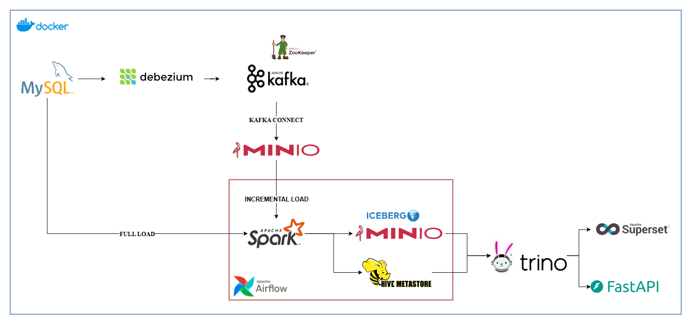
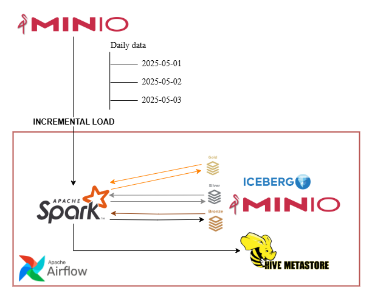

# Complete Open-source End-to-end Data Pipeline
A **Docker-based** data pipeline to ingest and synchronize data from **MySQL** to **MinIO Iceberg Table** using **Debezium** for Changed Data Capture (CDC), **Apache Spark** for processing, **Apache Airflow** for orchestration and **Trino** for querying.





**What have been done in this pipeline**
- Capturing MySQL database changes via Debezium (CDC).
- Processing data with Apache Spark.
- Incrementally loading results as Iceberg Tables from Kafka to MinIO (S3-compatible storage), with Hive Catalog.
- Orchestrating Spark jobs with Apache Airflow.
- Building Trino as query tools to query data on Iceberg Tables.
- Using BI tool Superset and FastAPI to query via Trino.
- Fully containerized with Docker for scalability.

## Table of Contents
- [Prerequisites](#prerequisites)
- [Installation](#installation)
- [Usage](#usage)
- [License](#license)

## Prerequisites
WSL version: 2.4.12.0

Docker version: 28.0.2

[Referring: Installing Docker on WSL](https://docs.docker.com/engine/install/ubuntu/#install-using-the-repository)

## Installation
1. Clone the repository

```$ git clone https://github.com/lmnguyet/open-source-end-to-end-data-pipeline.git```

2. Create network and volumes

```$ docker network create my-network```

```$ docker volume create spark_home_data```

3. Build Spark, Airflow, SuperSet and FastAPI images

```$ docker build -t spark-img ./spark```

```$ docker build -t airflow-img:2.9 ./airflow```

```$ docker build -t superset-img ./superset```

```$ docker build -t fastapi-img ./fastapi```

4. Start the services

```$ docker compose up -d [service names]```

```$ export AIRFLOW_UID=$(id -u)```

```$ docker compose -f docker-compose.airflow.yml up -d airflow-init```

```$ docker compose -f docker-compose.airflow.yml up -d```

## Usage
1. Check MySQL databases

```
$ docker exec -it mysql mysql -u <your database user> -p
Enter password:
```

```
mysql> use <database name>;
```

2. Check the UIs
- Kafka: http://localhost:9089
- MinIO: http://localhost:9001
- Spark: http://localhost:8080
- Airflow: http://localhost:18080
- Superset: http://localhost:8088

3. Create connectors with Kafka Connect
- From MySQL to Kafka (Debezium)

```
$ curl -i -X POST -H "Accept:application/json" -H "Content-Type:application/json" \
                    localhost:8083/connectors/ -d @connector/conf/mysql-connector.json
```

- From Kafka to MinIO

```
$ curl -i -X POST -H "Accept:application/json" -H "Content-Type:application/json" \
                      localhost:8083/connectors/ -d @connector/conf/minio-connector.json
```

- Check if the connectors are created

```
$ curl -H "Accept:application/json" localhost:8083/connectors/
["mysql-connector", "minio-connector"]
```

4. Run Spark jobs without orchestrator

```
$ docker exec -it spark-master spark-submit <spark job>.py
```

The Spark jobs include:
- ```bronze_full_load```: Full-loading initial tables from MySQL database to bronze tables.
- ```create_tables```: Creating Iceberg tables and snapshots tracking table for upper-layer loading jobs.
- ```bronze_incremental_load```: Incremental-loading daily ingested data into full-loaded bronze tables.
- ```silver_incremental_load```: Incremental-loading from bronze layer to silver layer, and reconstructing database schema.
- ```optimize```: Compacting and cleaning data files after some times.

5. Run Spark jobs with Airflow

Create connector ```spark-conn``` to connect to ```spark-master```.

```
host=spark://spark-master
port=7077
deploy_mode=client
```

Trigger DAG on Airflow webserver, make sure your Spark, Hive Metastore and MinIO Storage are running.

```$ docker ps```

6. Query Iceberg Tables with Trino

```
$ docker exec -it trino trino

trino> select * from iceberg.default.<table_name>;
```

7. Create a chart with Superset

Create a database connection to Trino.

```trino://trino:@trino:8080/iceberg```

Create a dataset from the connection & make your own charts/dashboards.

8. Query Iceberg Tables via FastAPI

```
curl -X POST "http://localhost:8000/query" \
-H "Content-Type: application/json" \
-d '{
    "sql": <Your SQL query>
}' | jq
```

## Reference
